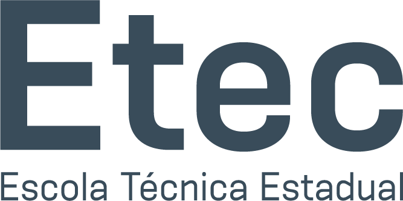

# ETEC 2025

Esse é um repositório para todos os estudos do curso técnico de Desenvolvimento de Sistemas da ETEC Cidade Tiradentes no ano de 2025. Nele, eu estou no 3° ano de curso.

---
## Matérias
Atualmente tenho 5 matérias, sendo estas:
- Progrmação Web
- Internet, Protocolos de Segurança e Informação
- Qualidade e Testes de Software
- Sistemas Embarcados
- Programação de Aplicativos Móveis
